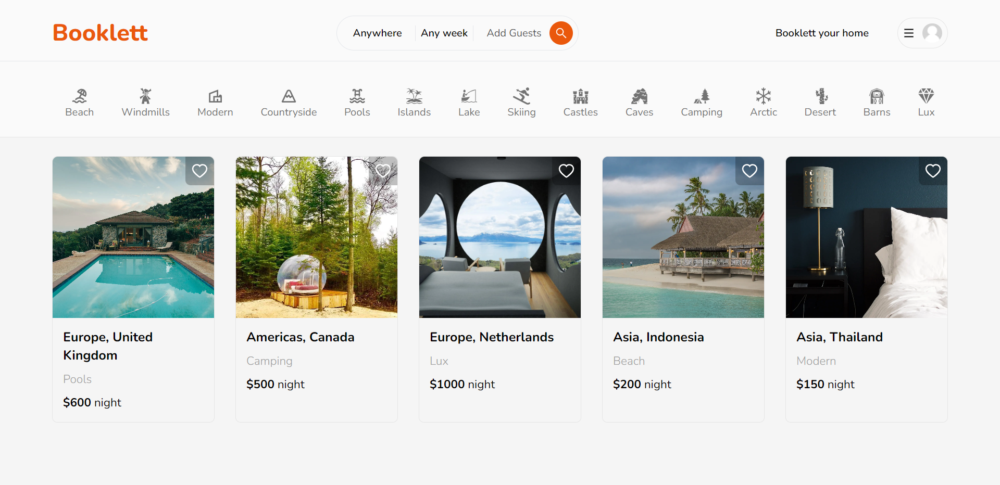

# Booklett - Fullstack Airbnb clone



### Build with

| Tool                |                            |
| ------------------- | -------------------------- |
| Languages           | Typescript                 |
| Framework           | Next JS 13 (app directory) |
| Database            | Mongo DB                   |
| Database connection | Prisma                     |
| Styling & animation | Tailwind CSS & Headless UI |
| Authentication      | Next Auth                  |
| Image upload        | Cloudinary                 |

### Features

- Full responsiveness
- Credential authentication
- Google authentication
- Github authentication
- Reservation system
- Owner and guest reservation cancellation
- Creation and deletion of properties

### Setup .env file

```js
DATABASE_URL=
NEXTAUTH_SECRET=
GOOGLE_CLIENT_ID=
GOOGLE_CLIENT_SECRET=
GITHUB_ID=
GITHUB_SECRET=
NEXTAUTH_SECRET=
NEXT_PUBLIC_CLOUDINARY_CLOUD_NAME=
NEXT_PUBLIC_CLOUDINARY_UPLOAD_PRESET=
```

### Start project on local machine

```shell
npm install
npm run dev
```
